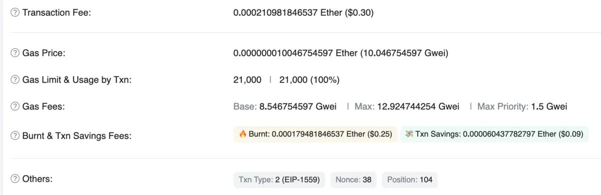

# 重构设计思路

> **PanGu Blockchain System**

整体项目的重构原则：所有的数据结构体都有对应的struct和interface接口，一个负责定义数据类型，一个负责实现所有可能需要的方法。

## 交易结构

### 1 交易封皮Cover

交易结构进行重新设计，采用交易外面套一层Cover的结构，而内部的敏感信息对于外人是保密的。

- 首先一个问题是，为什么要加一个Cover？

  因为在现有的以太坊模式下，用户完成一笔交易（调用智能合约）前，这笔交易的所有信息都是公开可见，这就会导致某些恶意节点干扰用户这笔合约调用的正常进行。因此，我们能否将用户调用什么合约，怎么调合约这个过程进行加密？因此就诞生了如今的这个想法，如图所示，Cover部分表明了交易地址，Nonce以及相关必要信息，而最关键的Date，也就是调用智能合约的代码并不在Cover部分，而是放在了加密字段处，外人无法得知具体内容。

- 为什么我们不采用门罗币这种全部信息都加密的方式呢？

  门罗币侧重的是隐私转账，而我们更加关心的是用户执行智能合约时可以在没有隐私泄露的前提下进行，因此我们并不需要完全对所有的信息进行隐藏，而是只隐藏了最关键的Data等信息。

目前暂定的交易结构

```go
// 交易需要缓存的信息
type TransactionCache struct {
    hash atomic.Value
	size atomic.Value
	from atomic.Value
}

// 后续维护扩展可能需要增加的字段，全部都集中于这个结构体中
type TxMisc struct {
    Type byte
    ChainId *big.Int
}

// 单个盘古交易
type PanguTransaction struct {
    // Cover
    TransactionCache	// 缓存
    
    TxMisc	// 后续升级需要增加或修改的字段
    
    Nonce       uint64
    Value       *big.Int
    GasLimit    uint64
    GasPrice    *big.Int

    SenderSigAlgo     byte		// 用户选择的签名算法
    Signature         []byte	// 用户签名
    GuarSigAlgo       byte		// 用户选择的签名算法
    Ensurance         []byte	// 担保人签名

    // 内部信息
    TxContent				// 解密后的交易内容
    EncryptionAlgo  byte	// 加密算法
    EncryptedContent []byte	// 加密后的交易内容
}

// 交易核心内容
type TxContent struct {
    VmType      byte			// 用户选择的虚拟机
    To          *common.Address	// 交易接收地址
    Data        []byte			// 调用合约代码
    AccessList  AccessList		// AccessList
}
```

### 2 担保人

#### 问题来源

区块链交易担保人的提出来源于现实中保险公司的例子。在盘古系统中，由于所有的交易都会按照AccessList分组并执行，对于AccessList与实际执行显示不一样的交易，区块链会进行惩罚性的额外扣费。然而，对于一些用户而言，他们根本就不知道AccessList是什么，怎么写，甚至自己的交易数据是否填写的有问题也不知道。如何解决这个问题？

当然，我们可以提供一个预运行系统，交易在正是发送到区块链前可以在钱包中按照当前的区块链环境先跑一遍来检查错误。但是这样不仅消耗了系统的算力，而且就算出错了，用户也不一定有足够的专业技能去修改出错的原因。因此，我们想到了现实世界中的保险——==我们能不能给交易提供一个保险呢==？

#### 设计思路

在盘古系统中，担保人可以是个人，但我们更倾向于类似于公司一样的形式。用户在发送交易前，如果对自己的交易内容等正确性不放心，担心额外收费的问题，他就可以先将交易发送给担保人。担保人帮助用户修改交易，填写AccessList后，确保该交易没有问题，再将这笔交易进行签名，**之后把交易返回给用户**。用户收到交易后，确认该交易修改等问题后，对整个交易，包括担保人的签名进行签名，之后把交易发送给担保人。担保人统一收集后会将交易进行聚合然后发送到区块链开始执行。

在交易执行过程中，如果交易出错，或者AccessList不符合等种种问题，系统会对交易的汽油费进行额外收取。如果这笔交易被担保，那么这时系统会扣担保人的钱，也就是说，==**一旦一笔交易被担保，那么之后与这笔交易有关的汽油费，惩罚汽油费等都会从担保人这里进行扣除**==。

> 我们把整个过程详细归纳一遍：

1. 用户`User`决定发起一笔交易，由于担心自己的数据可能有问题，并且想要支付更低的汽油费，同时也不在意交易延迟被发送，那么他首先将交易发送到一个自己信任的担保人`G`；
2. 担保人`G`检查用户`User`发过来的交易，修改错误。在检查无误后，他会预执行这笔交易，假设预执行耗费的汽油费为`GasPre`，则担保人`G`会收取该用户`GasGuar = GasPre - GasDecr`作为担保费，其中`GasDecr`是相比于正常执行减少的费用，通常由担保人自己决定；
3. 担保人对检查过的交易进行签名，记为`SignG`，之后回返回给用户User，用户User检查无误后对包括担保人签名在内的整个交易进行签名，记为`SignU`，之后将交易再返回给担保人；
4. 担保人在收集到了足够多的交易后，进行交易聚合，也就是把n个交易打包到一个交易结构中，只在Cover进行签名即可，然后担保人可以将包含多笔交易的交易集合发送到区块链开始执行；
5. 矿工在收到一笔交易后，由于加密机制，他在执行前只能看到`Cover`部分，而通过`Cover`部分无法推断出这笔交易是否是聚合交易，因此矿工会无差别的接收所有的交易开始执行。如果这笔交易是聚合交易，则在执行过程中以更低的汽油费运行，假设在交易正常执行的情况下，交易集合中的单笔交易总的汽油费为`GasPol`，非集合的单笔交易总的汽油费为`GasSignle`，其需要满足不等式`GasPol < GasGuar < GasSignle`，才能保证用户和担保人均可获利；
6. 如果交易出错，则要进行惩罚。如果这笔交易已经被担保，则需要扣除比正常执行更多的汽油费，即已被担保交易扣除汽油费为GasErrPol，未被担保扣除汽油费为GasErrSingle，需要满足`GasErrPol > GasErrSingle > GasPre`。注意，**上述已担保交易扣除的汽油费来源是担保人**，也就是说已担保交易用户只需要支付担保费，之后的汽油费用扣除都与担保人有关，与用户无关。


#### 问题讨论

我们再来细分一下这个过程中可能存在的一些问题：

> 用户为什么要选择担保人，他完全可以直接发送这笔交易

在Pangu系统中，用户选择担保交易，则可以只支付更少的汽油费，但是需要等待更多的时间，因为担保人需要足够多的交易来进行聚合。用户如果不选择担保交易，则他需要支付更多的汽油费，但是不需要等待担保人手机足够的交易进行聚合，可以随时发送交易开始执行。

> 这个过程涉及到的相关费用大小怎么设计才算合理

假设，交易Tx估算运行消耗的汽油费为GasPre，用户支付的担保费为GasGuar；

Tx未担保，正常执行：GasFreeYes

Tx已担保，正常执行：GasGuarYes

Tx未担保，错误执行：GasFreeNo = GasLimit

Tx已担保，错误执行：GasGuarNo

用户通过担保交易一定能比直接交易支付的汽油费少：`GasGuar < GasPre`

已担保的交易在正常情况下可以以更低的汽油费来运行：`GasGuarYes < GasFreeYes`

已担保的交易如果出错需要扣除更多的汽油费：`GasGuarNo > GasFreeNo > GasPre > GasGuar`

理论而言，汽油费价格应该和交易是否担保，聚合交易内的交易数量有关，交易已担保，聚合交易内的交易数量越多，则汽油费价格越低；反之，如果交易出错，交易已担保，聚合交易内的交易数量越多，惩罚的汽油费也就越多。暂定 GasGuarNo = 1.5 * GasFreeNo = 1.5 * GasLimit

> 用户能否在担保人签过名后故意写错数据

担保人对整个交易进行签名，如果用户对交易数据进行修改，就会无法验证签名

> 用户能否自己给自己担保，以获得更低的汽油费价格

当然可以，如果用户自己有能力自己给自己检查交易，预执行交易，用户完全可以自己给自己签名，这时候他就可以以更低的汽油费价格来执行交易。但是，如果交易出错，或者AccessList与实际获得的AccessList不符，根据上述规则，用户需要扣除比未担保错误执行交易更多的汽油费，这种情况下用户实际上比不自己给自己担保亏损的更多。==我们推出担保人机制和交易聚合的本质目的不是为了让某一方赚取更多的或更少的汽油费，而是为了加大系统吞吐量与执行效率，尽可能的防止错误交易导致系统出现的快照回滚等问题==。因此，用户如果自己有能力自己给自己担保，他就可以获得更低的汽油费价格作为奖励，相反的，如果他没有对应的能力却依然自己给自己担保，那么他就要承担交易执行出错导致更大的损失。

### 3 交易聚合

### 4 聚合签名

## EIP 1559

我们拟在第一次重构（基础项目打通）中使用EIP1559方案来进行汽油费的收取。

相关链接：[EIP 1559: Fee market change for ETH 1.0 chain](https://eips.ethereum.org/EIPS/eip-1559)

### 1 简介

以太坊EIP-1559是以太坊网络的一个重要升级提案，旨在改善以太坊的交易费用机制。

EIP-1559的目标是解决以太坊网络中的两个主要问题：不确定的交易费用和网络拥堵。在当前的以太坊网络中，用户需要通过向矿工支付交易费用来确保他们的交易能够被包含在区块中，而这个费用是由市场决定的，因此具有很高的波动性和不确定性。此外，网络拥堵时，用户必须支付更高的费用才能够优先处理他们的交易。

EIP-1559引入了一种名为==**基本费用（Base Fee）**==的新机制，旨在解决这些问题。基本费用是每个区块中**由网络自动确定的固定费用**，它根据网络的使用情况动态调整。当网络拥堵时，基本费用会上涨，而在网络空闲时则会下降。这样一来，用户就能够更加准确地估计自己的交易费用，并且不再需要为了保证交易得到优先处理而支付过高的费用。

除了基本费用外，EIP-1559还引入了一个可选的==**小费（Tip）**==机制。小费是用户愿意额外支付给矿工的费用，以鼓励他们优先处理自己的交易。与基本费用不同，小费是**由用户自行提供**的，因此可以根据用户对交易的紧迫程度进行调整。

EIP-1559还规定了一个==**最大汽油费（gaslimit）**==，表示用户愿意为一笔交易支付的最大汽油费，该费用包括优先费用（Tip）和区块的基本费用（Base Fee）。

EIP-1559还引入了一个新的交易类型，被称为“封存交易”（Burn Transaction）。**每个区块中的基本费用部分将被销毁，从而减少了以太币的总供应量**。这有助于提高以太币的稀缺性，并可以对通胀进行一定程度的抑制。

总结一下，EIP-1559的主要特点包括：

1. 基本费用（Base Fee）：动态调整的固定费用，根据网络使用情况自动确定。
2. 小费（Tip）：可选的额外费用，用户愿意支付给矿工以优先处理自己的交易。
3. 封存交易（Burn Transaction）：每个区块中的基本费用部分将被销毁，减少以太币的总供应量。

通过这些改进，EIP-1559旨在提高以太坊的用户体验，使交易费用更加可预测和合理，并减轻网络拥堵的问题。这个提案已经在以太坊网络上进行了测试，并于2021年8月5日成功地在以太坊的伦敦硬分叉中激活。

### 2 分析

以往的以太坊交易费的模式完全是一种激励模型，如果用户指定更高的gas Price，就会被矿工优先打包交易，这么做会造成一些问题：

1. 交易费用的波动和交易的社会成本不匹配
2. 造成用户不必要的延迟等待：每个区块的gas Limit是有限的，交易可能需要等待好几个区块才能被纳入。现在没有一个机制让区块的大小可以动态变化。
3. 第一次拍卖效率低下：当前的方法中，用户需要指定最高的gasPirce，矿工选择最高的打包。这种交易费竞价机制导致交易费不好预估，并且用户往往付出了比真实成本更高的费用。
4. 当区块奖励消失后，区块链会变得不稳定

因此，在EIP-1559中，引入了Basefee的概念，它可以随着网络的拥堵情况而动态变化。当某个区块的gas目标值被耗尽，说明这时候交易比较拥堵，basefee会逐渐上涨，反之，如果现在不拥堵，则basefee会逐渐下降。这个机制下，basefee的改变是确定的（它会根据上一个区块所用的gas和target gas，也就是之前的gas limit，来调整），所以钱包应用可以自动给用户设置非常可信的gas fee，大多数情况下不再用自己设置gas fee了。

对于大多数用户来说，basefee会被钱包自动设置，并指定一笔priorityfee，这个fee是为了激励矿工的，也是会自动被设置。用户可以自行设置max fee，以限制最大的fee支出。

这个fee系统中，矿工拿不到basefee，因为basefee会被销毁，矿工只能拿到priorityfee。

### 3 使用

为了具体理解EIP-1559的工作原理，我这里以一个具体的例子来说明，这是从以太坊交易记录中随便找的一个交易记录截图。



这上面的每个字段都代表啥意思呢？

- ==**Transaction Fee**==：这是最终实际用户所付出的 Gas 费。在这笔交易里也就是价值差不多 0.3 美金的 ETH。在 [EIP-1559](https://learnblockchain.cn/article/1133) 之前，这笔费用是全部分给矿工的。在 EIP-1559 之后，这笔费用分成了两部分，一部分还是给矿工，但更大的一部分是直接销毁掉的。在这笔交易里，有大概价值 0.25 美金的 ETH 是被直接销毁的，有 0.3 - 0.25 = 0.05 美金的 ETH 是分配给矿工的。

- ==**Gas Price**==：这个和 EIP-1559 之前的 Gas Price 含义相同，是用户为每一个单位的 Gas 所付出的费用。也称 Gas **价格**。

  与 EIP-1559 之前不同的是，之前的 Gas Price 都是用户指定的，这里的 Gas Price 是按公式计算出来的：**Gas Price = Base Fee + Max Priority Fee**

- ==**Gas Limit**==：这个一直没啥变化，是用户允许这笔交易最大可消耗的 Gas **数量**。

- ==**Usage by Txn**==：这笔交易实际所消耗的 Gas **数量**，如果像这里演示的这笔交易一样是笔普通的 ETH 转账交易，这个值为固定值 21000。其它交易的值都是大于 21000 的某个值。值得注意的是，这个值是小于等于 Gas Limit 的。

- ==**Gas Fees**==：这个叫法很容易让人和 Transaction Fee 产生混淆，更准确的说这是每个单位 Gas 的**价格**。这部分费用由三部分构成：Base Fee，Max Fee 和 Max Priority Fee。

  - ==**Base Fee**==
    Base Fee 是由以太坊网络而不是用户或矿工确定的值。它根据最近确认区块的使用率来自动升高或降低。所谓区块使用率，是指打包到区块中所有交易所消耗的 Gas 量占整个区块 Block Gas Limit 的比例。

    > 如果上一个区块使用率正好是 50%，Base Fee 保持不变。
    > 如果上一个区块使用率正好满载 100%，Base Fee 会提高 12.5%。
    > 如果上一个区块使用率超过 50% 但小于 100%，Base Fee 会提高不到 12.5% 的某个值。
    > 如果上一个区块使用率是 0%，也就是空块，Base Fee 会降低 12.5%
    > 如果上一个区块不是空块且使用率没超过 50%，Base Fee 会降低不到 12.5%

    简而言之，当区块使用率超过 50% 时，下一个区块的 Base Fee 会自动升高，最高比例为 12.5%，当区块使用率低于 50% 时，下一个区块的 Base Fee 会自动降低，最高比例为 12.5%。

    相对之前 Gas Price 完全由用户提供，经常大起大落，Base Fee 的变化显然是更加可预测也更加平缓的

    每个区块的 Base Fee 是维护在区块头中的。

    发送交易的时候，用户不需要指定 Base Fee。

  - ==**Max Priority Fee（Tip）**==
    Max Priority Fee 又被称为矿工小费 Miner Tip。是为了让自己交易被优先打包额外付给矿工的费用。
    这个费用不是必须要付的。一般来说付个 1 ～ 2 GWEI 意思意思就好了。当然要享受 VIP 待遇可以付更多。

  - ==**Max Fee**==
    Max Fee 是为每单位 Gas 所愿意付出的最高费用。这个是在发送交易时需要用户指定的。为啥需要这么个 Max Fee 呢？

    我们知道为一笔交易最小要支付的费用是 Base Fee。但 Base Fee 也是会按照网络拥堵情况进行调整的，如果交易发出去之后，在被打包进区块之前，Base Fee 调高了，那么所发送的交易就处于"给价过低"的状态，这笔交易有可能会长期在网络中游荡没节点处理，甚至直接被节点丢弃掉。

    为了避免这种不可预料的情况，我们需要设一个 Max Fee。把有可能 Base Fee 上调的可能性考虑进去，增加交易被打包成功的概率。实际的花费大概率是比 Max Fee 要低的。

> **Max Fee**设置公式

```go
Max Fee = (2 * Base Fee) + Max Priority Fee
```

> **Burnt**：销毁掉的 ETH 数量

```go
Burnt = Base Fee * Gas Usage by Txn
```

> **Tx Savings Fees**：愿意付的最高费用和实际花费的差额

```go
Tx Savings Fees = Max Fee * Gas Usage by Txn - (Base Fee + Max Priority Fee) * Gas Usage by Txn
```

注意，用户实际支付汽油费时的汽油费价格应该是`Base Fee + Tip`

用户愿意支付的最高汽油费价格应该是`Max Fee`

**按照EIP-1559官方文档的定义，结构体中有三部分和汽油费有关：Tip，Max Fee，gaslimit。**

参考文章：https://learnblockchain.cn/article/4576

